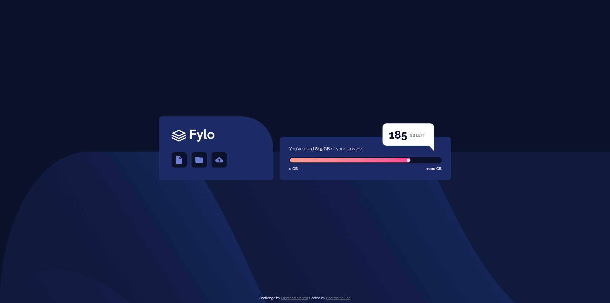
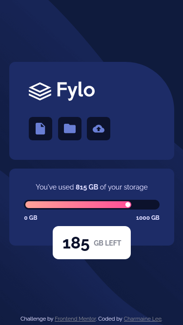

# Frontend Mentor - Fylo data storage component solution

This is a solution to the [Fylo data storage component challenge on Frontend Mentor](https://www.frontendmentor.io/challenges/fylo-data-storage-component-1dZPRbV5n). Frontend Mentor challenges help you improve your coding skills by building realistic projects.

## Table of contents

- [Overview](#overview)
  - [The challenge](#the-challenge)
  - [Screenshot](#screenshot)
  - [Links](#links)
- [My process](#my-process)
  - [Built with](#built-with)
  - [What I learned](#what-i-learned)
  - [Continued development](#continued-development)
  - [Useful resources](#useful-resources)
- [Author](#author)
- [Acknowledgments](#acknowledgments)

## Overview

### The challenge

Users should be able to:

- View the optimal layout for the site depending on their device's screen size

### Screenshot

### Links

- Solution URL: [Solution of the challenge](https://www.frontendmentor.io/solutions/responsive-storage-component-css-grid-and-flexbox-zRE9cNDfW)
- Live Site URL: [Live site of the challenge](https://nostalgic-einstein-1ebf17.netlify.app/)

## My process

### Built with

- Semantic HTML5 markup
- CSS custom properties
- Flexbox
- CSS Grid
- Mobile-first workflow

### What I learned

Creating a speech bubble using CSS was something new for me in this project. It was a good starter for me to practice how pseudo-elements like ::before and ::after work. I've also learnt new ways in creating a background behind icons rather than just using the good old mighty padding, which is not possible in this case as the difference in icon dimensions will result them not looking uniform. Flexbox was a really great tool in helping me eliminate this issue. Creating the storage meter was also a really fun experience, even though currently I can only using CSS to make it appear like a meter which has no function at all.

### Continued development

Areas which I want to familiarise myself with after this challenge:

- pseudo-elements
- positioning of elements using grid/flex rather than just tweaking the position
- how background image works
- responsive webpage

### Useful resources

- [Understanding how background image operates](https://css-tricks.com/perfect-full-page-background-image/) - This is something I always go back to whenever I need to refresher on how background image can be manipulated in order to produce my desired effect.

## Author

- Find me here - [Charmaine Lee](https://www.linkedin.com/in/charmainelee-huimin/)
- Frontend Mentor - [@charmainelhm](https://www.frontendmentor.io/profile/charmainelhm)

## Acknowledgments

Practice is a very important learning stage in coding, and I want to thank Frontend Mentor for making it easier for me to do that. With their help, I can focus on understanding the different properties in HTML and CSS with my minimal knowledge on UI and UX design.
